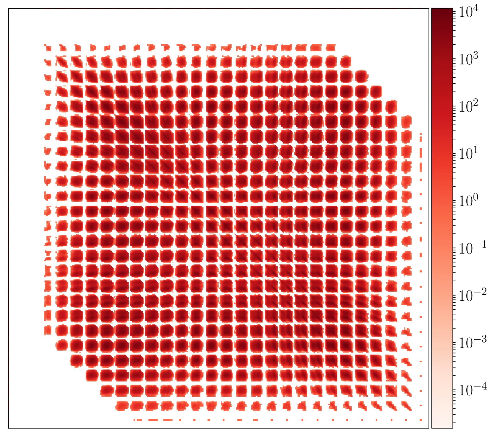
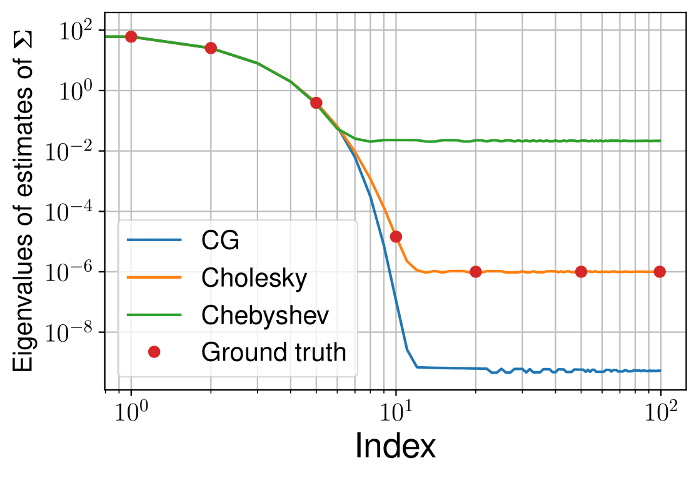

.. PyGauss documentation master file, created by
   sphinx-quickstart on Wed Oct 23 22:32:22 2019.
   You can adapt this file completely to your liking, but it should at least
   contain the root `toctree` directive.

.. _PyGauss: https://github.com/mvono/PyGauss
.. _arXiv: https://arxiv.org/abs/2010.01510

Welcome to PyGauss_'s documentation!
====================================

As a contraction of **Python and Gaussian**, **PyGauss** is the companion package associated to the paper entitled *High-dimensional Gaussian sampling: A review and a unifying approach based on a stochastic proximal point algorithm* [1] which is publicy available on arXiv_.

This package, written in PYTHON, aims at both reproducing the illustrations and experiments of [1] and providing the readers implementations of the Gaussian sampling approaches reviewed in [1].

.. |fig1|  image:: _images/Coepra_AA-1.png
    :width: 100%
    :alt: Precision matrix for Coepra dataset

.. |cap1| replace:: Precision matrix for Coepra dataset

.. |cap2| replace:: Precision matrix for MNIST dataset

.. |cap3| replace:: Eigenvalues of estimated covariance matrices

.. |fig4|  image:: _images/simu3_ESS-1.png
    :width: 100%
    :alt: ESS ratio for two samplers

.. |cap4| replace:: ESS ratio for two samplers

+---------+---------+
| |fig1|  | |fig2|  |
+---------+---------+
| |cap1|  | |cap2|  |
+---------+---------+
| |fig3|  | |fig4|  |
+---------+---------+
| |cap3|  | |cap4|  |
+---------+---------+

Installation instructions
-------------------------

See the `installation instructions <https://github.com/mvono/PyGauss#installation>`_ on GitHub.

Documentation contents
----------------------

.. toctree::
   :maxdepth: 3
  
   direct_sampling/index
   mcmc_sampling/index
